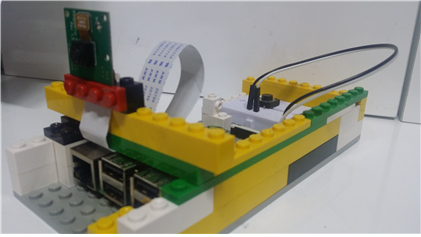
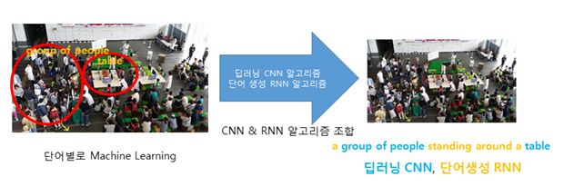
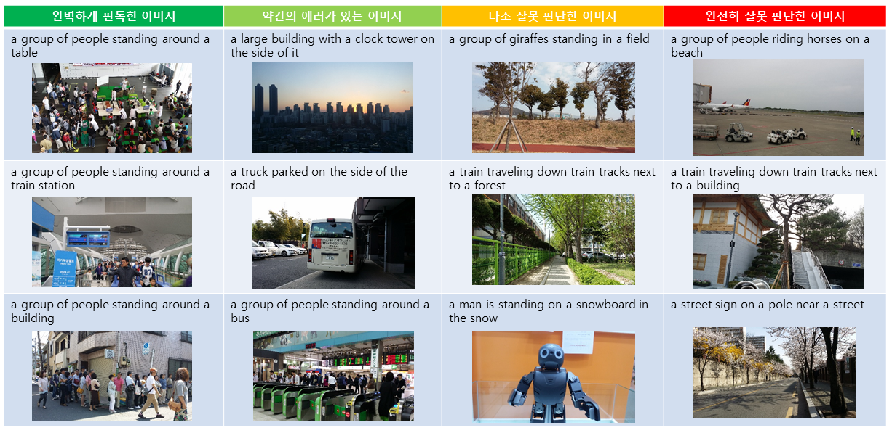

# Image Explanation Software for the Blind(시각장애인을 위한 이미지 설명 프로그램)
> **Image Explanation Software for the Blind** 
> Taewon Kang(Sejong Academy of Science and Arts) 
> 2016.01. - 2017.05. 
> 
> **Abstract:** *Image Explanation Software for the Blind is a program that reads images for the blind. When a user presses a button, Raspberry Pi takes a picture of an object and explains that image to the user using Text To Speech (TTS). You can hear the explanations for images not only in English but Korean as well. Currently, I am developing 'Error Check Algorithm' for this software. Using 'Open Source Dataset', which contains Learning Images, Test Images, Verified Images, the algorithm makes sentences correctly. My software algorithm works like a camera recognizing faces. Using Convolutional Neural Network (CNN) algorithm. CNN algorithm makes key words such as 'group of people' and 'table'. In addition, Recurrent Neural Network (RNN) algorithm makes optional words such as 'a', 'standing', 'around', etc. Finally, this algorithm makes sentences using key words and optional words and explains images using TTS. TTS and explanation algorithms can be used offline when you download library on the website. Even though the Image caption research has been conducted actively, there was no software that explained images for the blind. In addition, this machine learning algorithm based on Raspberry Pi can be applied to wearable devices such as canes, glasses, and watches that blind people use. The software is using Raspberry Pi and embedded devices, so the blind can take pictures by themselves and hear the explanations through the TTS. And, I will develop features that respond to urgent situations and include them in the machine learning so that users can hear the warning alerts. Later, I will make an algorithm that not only recognizes images but even texts and signs within images. Reward Scores will be given when the machine correctly recognizes images so that the algorithm can improve.*

Contact: Taewon Kang (itschool@itsc.kr)

## Description (Korean)
지난 2016년 1월부터, 9개월간의 과정을 거쳐 개발된 프로젝트인 '시각장애인을 위한 이미지 설명 프로그램' 을 공개합니다!

시각장애인을 위한 이미지 설명 프로그램 (Image Explanation Software for the Blind) 은 눈이 안 보이는 시각장애인에게 보이지 않는 상황에 대해 문장으로 설명하고, 설명된 데이터를 TTS (Text-To-Speech)를 이용, 실시간으로 설명을 들을 수 있도록 개발한 소프트웨어이다. (2016.10.22 수정) 현재도 업그레이드 중이다.
머신러닝 오픈소스 Dataset, Tensorflow를 이용 (오픈소스를 활용하였습니다. 혹여나 오해 없길 바랍니다.) 하므로 가장 정확한 문장 결과를 도출할 수 있으며, 지속적인 학습으로 어떠한 이미지든지 올바른 결과를 도출할 수 있다.

이미지 설명 프로그램의 알고리즘은 촬영된 이미지를 카메라의 Face Recognition처럼 CNN 알고리즘 (특정 부위를 잡아 단어로 설명하는 알고리즘) 을 이용해 단어로 변환이 가능한 특정 부위 각각을 Machine Learning (group of people, table 등) 후 단어를 도출해 낸다. 이후 이 단어들을 바탕으로 RNN 알고리즘이 부가 단어 (a, standing, around 등)를 생성한다. 마지막으로 이를 조합하는 알고리즘을 사용하여 조합하면 단어가 완성된다. 위의 이미지를 참고하면 이해가 쉬울 것이다.

현재까지 Image Caption에 대한 연구는 활발히 진행되고 있지만, 시각장애인을 위한 이미지 설명 프로그램은 존재하지 않았다. 시각장애인을 위한 이미지 설명 프로그램은 Raspberry Pi 등의 Embedeed Device를 활용하여 시각장애인이 혼자서도 이미지를 촬영하여 TTS로 설명을 들을 수 있고, 이를 적정기술로 활용해 경제, 사회적으로 약자인 시각장애인 뿐만이 아닌 오지, 즉 제3세계에도 보급이 가능하다. 또한 청소년들이 장비 조립방법, 머신러닝 이론 등을 배울 수 있도록 소프트웨어 교육과도 연계시킬 수 있다. (2016 제 33회 한국정보올림피아드 공모부문 은상 수상작)

### 제작 배경
사회의 불평등, 불편함 해소에 내가 가지고 있는 재능을 발휘하여 문제를 해결하고 싶다는 생각을 가지고 주변을 유심히 살펴보았다. 어느 날 지하철역에서 시각장애인의 도움요청에 응했고 시각장애인들의 열약하고 불편한 상황을 알게 되었다. 그래서 그러한 문제를 해결해 보려고 프로그램을 만들겠다는 생각을 하였다. 또, 우리 학교에는 시각장애인 선생님이 계신다. 옆에 항상 보조 선생님이 계시는데 자주 보조 선생님 이 바뀌고 구인광고를 내는 것을 알게 되었다. 시각장애인은 능력이 있어도 취업이 그리 쉽지 않겠다는 생각을 하였다. 보조선생님 도움 없이 혼자서 교사직을 수행해 낼 수 있는 방법을 찾아내기 위해 직접 인터뷰를 해 보았다. 처음 목표는 시각장애인이 길을 걸을 때 음성으로 내비게이션 역할을 해 주는 아이디어였다. 그래서 그런 애플리케이션이 필요한지 여쭈어 보았는데, 이미 그런 프로그램은 사용하고 있는 중이라고 답했다. 시각장애인 선생님은 영어 수업 때 이미지를 볼 수 없기 때문에 그 이미지가 어떤 것인지 문장으로 설명해 주는 프로그램이 필요하다고 하셨다. 그렇다면 수업을 할 때 보조선생님이 없어도 가능하다고 하였다.

### 프로그램 소개
이 소프트웨어는 시각장애인 및 시각장애인 교사(보조 교사 없이 혼자서 교사직이 가능하도록)에게 유용한, 'Image를 CNN/RNN 머신러닝 알고리즘을 이용해 문장으로 설명해 주는 소프트웨어'이다. 머신러닝 결과의 정확성을 높이기 위해 오픈소스 Dataset, Tensorflow를 활용한다. 300번 가량의 머신러닝 Test (실사 환경)를 토대로, 내 머신러닝 알고리즘의 정확도를 검증할 수 있었고, 내가 만든 Software를 라즈베리 파이에 32Bit Processor에 64Bit 기반으로 설치하여 이를 일상생활, 수업에 활용할 수 있도록 안경, 지팡이에 장착이 가능한 Embedeed 환경으로 개발하였다. 하드웨어에서는 버튼을 누르면 이미지를 촬영해 해당 이미지를 TTS로 변환해 설명해 준다.

위 이미지는 내가 촬영한 이미지 300개 (실제 라즈베리 파이에서 분석한 결과와 매우 흡사함) 를 분석한 결과로 완벽하게 판독한 이미지, 약간의 에러가 있는 이미지, 다소 잘못 판단한 이미지, 완전히 잘못 판단한 이미지 4개 영역으로 분류하였다. 주로 시각장애인이 보는 환경에서는 (길거리 등에 사람이 있는 환경) 온전한 역할을 수행하기에는 알맞으며, 이런 에러가 있는 이미지들도 알고리즘이 실행하면 실행할수록 계속 학습하도록 체계가 구축되어 있기 때문에, 잘못 판단한 이미지들도 지속적인 학습을 통해 수정되어 나갈 것이다. 향후 이러한 학습 데이터로 미래 사회를 Machine Learning으로 변화시킬 수 있고, 더 정확한 설명 데이터를 제공할 수 있다.

### 작품 시연
 

https://youtu.be/nmrqdnxmiv4

### 개발일지
소프트웨어를 개발하면서 항상 내 프로젝트 개발 내용에 대해 개발일지에 기록한다. 이를 통하여 내 프로그램의 에러도 손쉽게 수정할 수 있고, 다른 사람이 내 개발일지를 보았을때 쉽게 프로그램 이해가 가능하다. 현재 [ 243 ]장이다.

## Usage
1. If you are running this project for the first time, you should download Dataset for Machine Learning. First, run the download.sh file. `bash download.sh`
2. When the download is complete, go to the codes directory. `cd codes`
3. [PC] If you are running this project on PC, run `python generate_caption.py -i ../images/(image for generate caption)`. your image must be in the images folder in the Main directory.
4. [Raspberry Pi] If you are running this project on Raspberry Pi, run `python project.py`. when button pressed(GPIO 18), Raspberry Pi takes a picture of an object and explains that image to the user using Text To Speech (TTS).

## Required library
1. Anaconda
2. chainer: `pip install chainer`
3. scipy-misc: `sudo apt-get install python-numpy python-scipy python-matplotlib ipython ipython-notebook python-pandas python-sympy python-nose`
4. skimage.transform: `sudo apt-get install python-skimage`
5. Cython: `pip install Cython --install-option="--no-cython-compile"`
6. scikit-image-master: `sudo apt-get install python-skimage`
7. libhdf5: `sudo apt-get install libhdf5-serial-dev`
8. h5py: `pip install h5py`
9. How to solve gTTS, mpg321 Voice API, Theano Error
   - gTTS: `pip install gTTS`
   - mpg321 : `sudo apt-get install mpg321, amixer cset numid=1 –-100`
   - How to solve Theano Error: `pip install --upgrade —no-deps git+git://github.com/Theano/Theano.git`

## Related Works
A lot of code are adapted from online.
 * [Show, Attend and Tell](http://proceedings.mlr.press/v37/xuc15.pdf)
